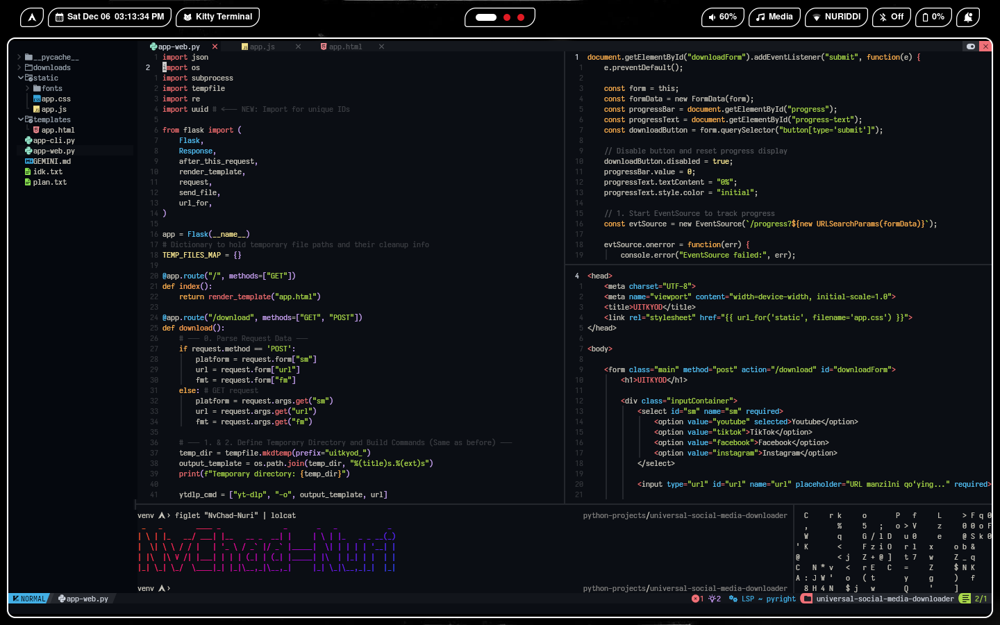

# NvChad-Nuri


🧙‍♂️ **SourceCodeSorcererNuri** tomonidan.

# NvChad-Nurini O'rnatish tartibi 👇🏻
#### Qilinishi shart bo'lgan ishlar:
- Eski neovim konfiguratsiyalarini o'chirib tashlash yoki saqlab qo'yish
- Mening NvChad-Nuri konfiguratsiyalarimni o'rnatish
- ba'zi bilish kerak bo'lgan narsalar

# 1. Eski neovim konfiguratsiyalarini o'chirib tashlash yoki saqlab qo'yish:

- Agarda siz avval LazyVim yoki NvimStarterPack kabi neovim disturbitsiyalridan foydalangan bo'lsangiz va uni saqlab qo'yishni hohlasangiz bu buyruqdan foydalaning:
```bash
mv ~/.config/nvim ~/.config/nvim-old
```
> [!NOTE]
> Bu buyruq bilan siz eski neovim konfiguratsiyalaringizni nvim-old papkasiga saqlab qo'yasiz va sizda yang NvChad-Nuri uchun bosh muhit paydo bo'ladi va siz buni bajarishingiz yoki o'chirib tashlashingiz kerak

- Agar siz oldin hech qanaqa neovim konfiguratsiyasini ishlatmagan bo'lsangiz va siz bemalol neovim papkasini o'chirib tashlashingiz mumkin **(Men tavsiya qilaman)**

```bash
rm -rf ~/.config/nvim
```
> [!NOTE]
> Bu buyruq bilan siz neovim konfiguratsiyasini to'liq olib tashlaysiz hamda butnunlay toza muhitda ishni boshlay olasiz va Bu yo'lni men tavsiya etaman

# 2. NvChad-Nuri konfiguratsiyasini o'rnatish

Siz mening konfiguratsiyalarimni o'rnatishdan avval kerakli dasturlarni o'rnatishingiz kerak bo'ladi va bu operatsiyon sistemangizga qarab o'zgaradi:

- Agar sizda debianga asoslangan operatsiyon sistema bo'lsa (Ubuntu, Debian, kali, linux mint va boshqalar):
```bash
sudo apt install zip unzip luarocks git npm wl-clipboard xclip neovim
```
- Agar sizda arch linuxga asoslangan sistema bo'lsa (Arch linux, EndavourOS, Manjaro va boshqalar):
```bash
sudo pacman -S --needed zip unzip luarocks git npm wl-clipboard xclip neovim
```
- Agar siz MacOS ishlatsangiz:
```bash
brew install zip unzip luarocks git node npm wl-clipboard xclip neovim
```

**2.1 Mening konfiguratsiyalarimni nusxalash va o'rnatish:**

Bu buyruq universal hamda hamma linuxga asoslangan operatsiyon sistemalarda ishlaydi **(Hattoki android telefonlarda termux orqali touchscreen bilan foydalanish ham mumkin)**:

```bash
git clone https://github.com/SourceCodeSorcererNuri/NvChad-Nuri/ ~/.config/nvim && nvim
```

- va bu buyruqdan keyin avtomatik ravishda neovim ochilishi hamda kerakli narsalar o'zi o'rnatishi kerak bu internet tezligiga qarab davom etadi va bu tugagandan keyin siz klaviaturadan **q** harifini bosib chiqasiz. 

Normal modeda: 

```
:MasonInstallAll
``` 

buyrug'idan foydalanasiz. Bu buyruq boshqa dasturlash tillarida bemalol autocomplete funksiyasini ishlatishda yordam beradi **(Qo'llab quvvatlangan tillar: C, C++, C#, Python, HTML, CSS, JavaScript, Bash va boshqalar)**

# 3. Bilish kerak bo'lgan narsalar:

**NvChad-Nuri** bu NvChad disturbitsiaysiga asoslang shaxsiy konfiguratsiya fayllari bo'lib original konfiguratiyasi **https://github.com/ProgrammingRainbow/NvChad-2.5** dan olingan. Bu shunchaki kunlik neovim foydalanuvchilariga va yangi linuxga kirib kelgan odamlar uchun Men Nuriddin tomonidan yig'ilgan konfiguratsiyalar to'plami.

- `Space` `t` `h` - **Mavzularni almashitirish**bu shortcut qanday ko'rinsa shunday amalga oshiriladi klaviaturada bu tugmalarni ketma-ketmalikda bosasiz va mavzular menusi ochiladi siz u yerda 100dan ortiq mavzularni tanlahingiz mumkin (men `ayu_dark` mavzusini ishlataman)

- `Space` `h` yoki `space` `v` - **Gorizontal yoki vertikal terminal ochish** bu shortcutda siz terminal ochasiz va focus terminalga beriladi siz neovimdan chiqmasdan turib terminaldan foydalana olasiz.

- `Ctrl` + `x` bu terminaldan focusni olib tashlaydi va siz boshqa oynalardan yana foydalana olasiz terminaldan fokusni olmaguningizcha boshqa oynalardan foydalanishga qiynalasiz

- `Space` `x` bu ochiq turgan oynani yoki panelni yopadi bular terminal, kod ochilgan maydon yoki boshqa narsa bo'lsin bu shortcut ularni yopadi.

- `Space` `f` `a` buning yordamida siz proyektingizda mavjud bo'lgan har bitta fayllarni menu orqali ocha olasiz.

- `Ctrl` + `n` Bu shortcut fayllar menusini ochadi va yopadi

- `"` `+` `y` bu klaviatura ketma-ketligida siz belgilangan matnni buferga nusxalab olasiz to'g'ri `ctrl` + `c` ni 2 marta bosish ham ishlaydi lekin bu universal shortcut sifatida qaraladi.

> [!NOTE]
> bu shortcutlar kunlik foydalanish uchun yetarli agarda sizda qanaqadir savol yoki murojatlar bo'lsa mana shu repo uchun issues oching men albatta javob qaytaraman.

**Meni ijtimoiy tarmoqlarda qo'llab quvvatlang:**

- Youtube: https://youtube.com/@source_code_sorcerer

- Instagram: https://instagram.com/source_code_sorcerer

- Telegram: https://t.me/SourceCodeSorcerer
